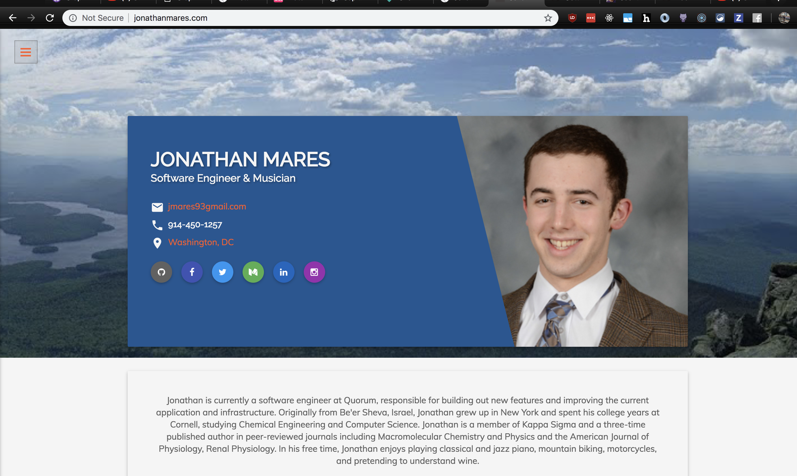

This week, while visiting grandparents in Israel, I decided to change my personal website to include a blog. My current website looks like this:

I chose this template a few years ago as it used Material Design and looked nice (to me, at least). At the time, I took the template and made it work in Jekyll, which made developing it a better experience. Jekyll has good blogging support in markdown, which is nice, but extending the current template to include a blog section seemed time consuming, and so I put it off for a long time.

Someone at worked linked to [GatsbyJS](https://gatsbyjs.org), which seemed like an attractive alternative to Jekyll, as it its in the `npm` ecosystem and is built with `React`, which I use at work daily. My next step was to find a place to start - `Gatsby` is very cool but has a lot of features and can be overwhelming at first.

I stumbled upon Jia's [website](https://jiahao.codes/) and was thoroughly impressed with the level of work he has put into the infrastructure and maintainability of his site. I decided to fork his repo and start from his point, which seemed much further along than any of the starter templates.

I've played with `GraphQL` a little bit in my free time, but am by no means confident with it yet. One
