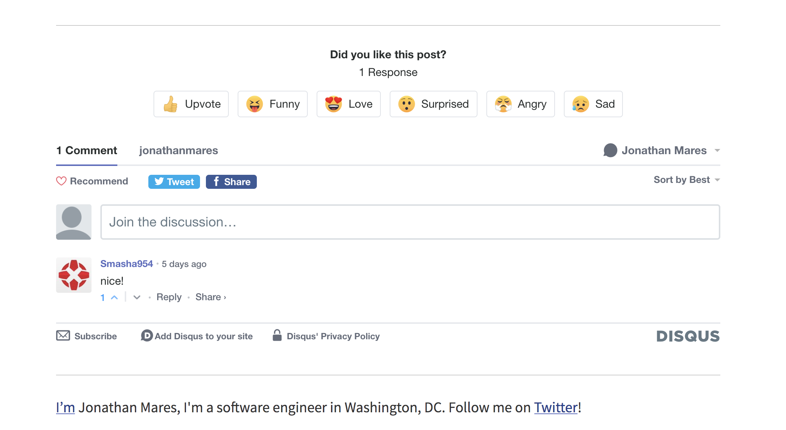

As I was building my blog, I wanted to add a comment section under my blog posts. I remembered Disqus had a decent interface for this, but a few of the guides on the internet were applicable for Gatsby V1. In this post we're going to go briefly go through how to add a drop-in Disqus component in a Gatsby V2 blog making comment management a breeze!


*Disqus comment section at the bottom of a post*

# Make an Account with Disqus
First, you'll want to go to the Disqus website and make an account. They will ask you to create a short name, which will be the identifier for your website or blog. I named mine `jonathanmares`. Any string without spaces should do.

# Install Dependencies
We will use [this](https://www.npmjs.com/package/react-disqus-comments) package to drop in a Disqus component. You'll first want to install the package via `npm` or `yarn`.

# Configure the Component

Import the component:
``` javascript
import ReactDisqusComments from "react-disqus-comments"
```

Then, we need to provide a few requirement props:
``` jsx
    <ReactDisqusComments
        shortname={disqusShortName}
        identifier={id}
        title={title}
        url={href}
        onNewComment={() => {}}
    />
```

You can provide the `shortanme` directly inline, or configure it in your site metadata, and then query for it. I liked the latter option a little more, but that is a out of the scope of this post.

The `identifier` is an important prop - Disqus must associate each post with a unique identifier. Conveniently, Gatsby 2 changed to using UUID's for the post `id`, so simply adding the `id` to your graphql fragment for a post and passing it to your `Post` component is all you have to do.

The `url` prop can be passed in a few ways. I chose to use the `href` prop that is available in `location`, as it provides the exact url the user is on. This will include query params and anchor CSS locators, but I have found that Disqus does not seem to mind them. You will need to make sure your template passes down the `location` prop. This looks like this for me:

``` jsx
const PostTemplate = ({
  data: {
    site,
    markdownRemark: {
      excerpt,
      id,
      fields: { slug },
      frontmatter: { title, date, excerpt: frontmatterExcerpt, cover },
      html,
    },
  },
  location, // make sure to destructure location
}) => (
  return (
    <Layout>
      <Head
        title={title}
        excerpt={frontmatterExcerpt || excerpt}
        path={slug}
        site={site}
        image={imageSrc}
      />
      <Post
        coverImageSizes={imageSizes}
        date={date}
        excerpt={frontmatterExcerpt}
        html={html}
        id={id}
        location={location} // Post component receives location
        site={site}
        title={title}
      />
    </Layout>
  )
)
```

I left the `onNewComment` blank, but I suppose you may find this callback useful.

My `Post` component looks something like this:

``` jsx
import React from 'react';
import PropTypes from 'prop-types';
import { Link } from "gatsby"
import ReactDisqusComments from "react-disqus-comments"
import styled from 'styled-components'
// ...

export default function Post({
  coverImageSizes,
  date,
  excerpt,
  html,
  id,
  location: { href },
  site: {
    siteMetadata: {
      disqusShortName
    }
  },
  title,
}) {
  return (
    <div>
        {/* ... Additional non essential code above */}
        <div dangerouslySetInnerHTML={{ __html: html }} />
        <hr />
        <ReactDisqusComments
            shortname={disqusShortName}
            identifier={id}
            title={title}
            url={href}
            onNewComment={() => {}}
        />
        <hr />
        {/* ... Additional non essential code below */}
    </div>
  )
}

```


# Thanks
I wanted to thank Zach Weishar for his original [post](https://zweishar.com/2018-01-18-gatsby-disqus/) and `mzabriskie` for the original React component that made this possible!
